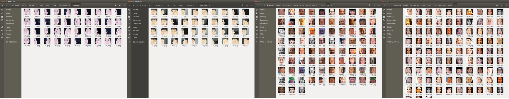
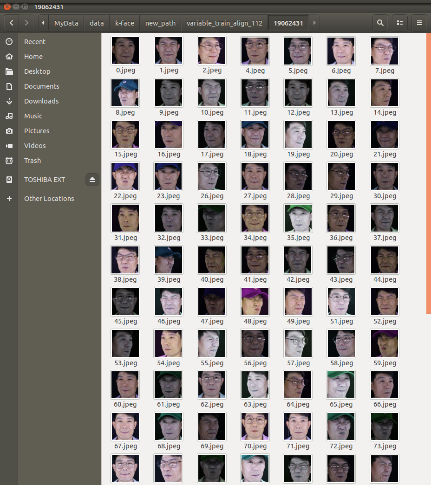
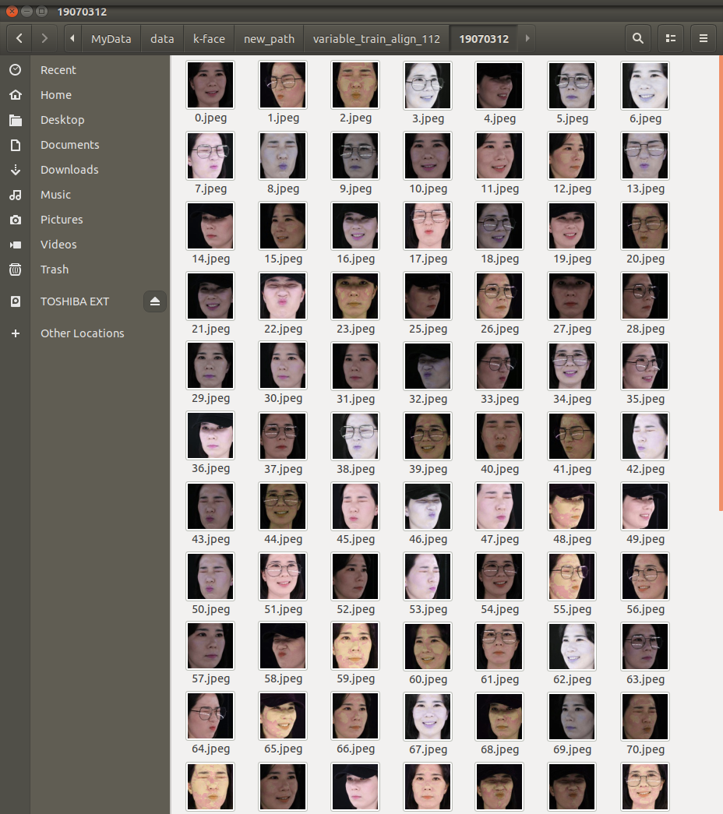
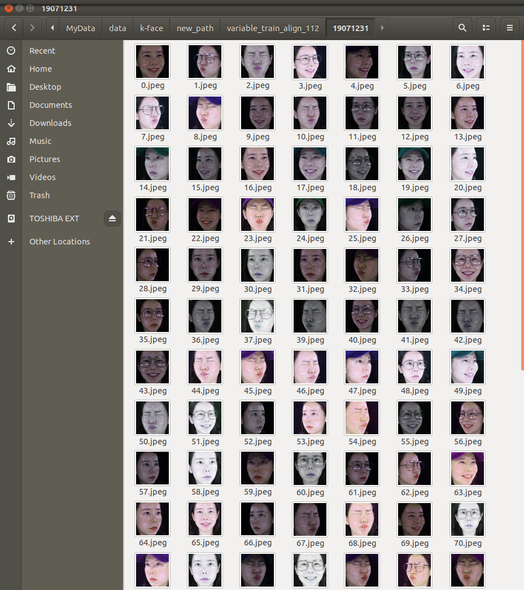

# [Project] Korean Face Classification 
> Korean Face Classification Model by Arcface

## dataset

* [Ms1m_align_112](https://drive.google.com/file/d/1X202mvYe5tiXFhOx82z4rPiPogXD435i/view)
* [AI_hub:K-Face](http://www.aihub.or.kr/aidata/73)

## data preprocessing

#### 1. [Select K-Face dataset]()
- 한 사람당 image가  32,400장으로 너무 많아 L1(조명-ㅣLux1000), S001(액세서리-보통), E01~E03(표정) 데이터만 사용하기로 함(1인당 train 40, test 20)
#### 2. [face_recognition]()
- ms1m_align_112 데이터가 가로,세로 모두 112pixel로 얼굴만 detection한 이미지이므로 k-face 데이터셋도 얼굴만 detection하여 저장함
	
  
	
-  ms1m_align_112 dataset이 데이터 수도 많고, 정면 얼굴도 많아 k-face dataset과 확연히 비교가 됨.
	
#### 3.[More Select K-Face dataset](https://github.com/shiney5213/Project-Arcface/blob/master/3. Select more K-face dataset .ipynb)
- k-face dataset에서 조명을 다양하게 하고, 수를 늘리는 재작업 수행
- 조명(L1, L2, L3),  액세서리(S001, S002, S005), 방향(C5~C10), 표정(E1, E2, E3) 데이터 사용(1인당 train 132, test 30)
- face detection 할 때 ms1m dataset과 비교하여 눈,코,입 부분만을 검출하거나 입이 잘리는 이미지가 있어 box크기를 조절함.
- 
#### 4. [Variety Image](https://github.com/shiney5213/Project-Arcface/blob/master/4. make variety image.ipynb) : random으로 이미지에 톤의 변화를 줌.

- Gammma_LUD방법을 사용하여 hue, satuationr값을 랜덤으로 조절

  <table>
      <tr>
      <td>
      <td>
      <td>
      <td>
      </tr>
  </table>

#### 5. [tfrecord file]() : tensorflow에서 빠르게 training 하기 위해 tfrecord 파일 만들기 

- slm_align_112 데이터와 K-face 데이터 : 모두 86144 폴더, 5822653개 이미지

* > face detection 112

*  [Making tfrecord_file]

## reference
* [ArcFace](https://arxiv.org/abs/1801.07698)
* [arcface-tf2](https://github.com/peteryuX/arcface-tf2)