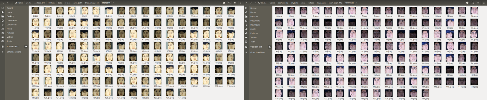
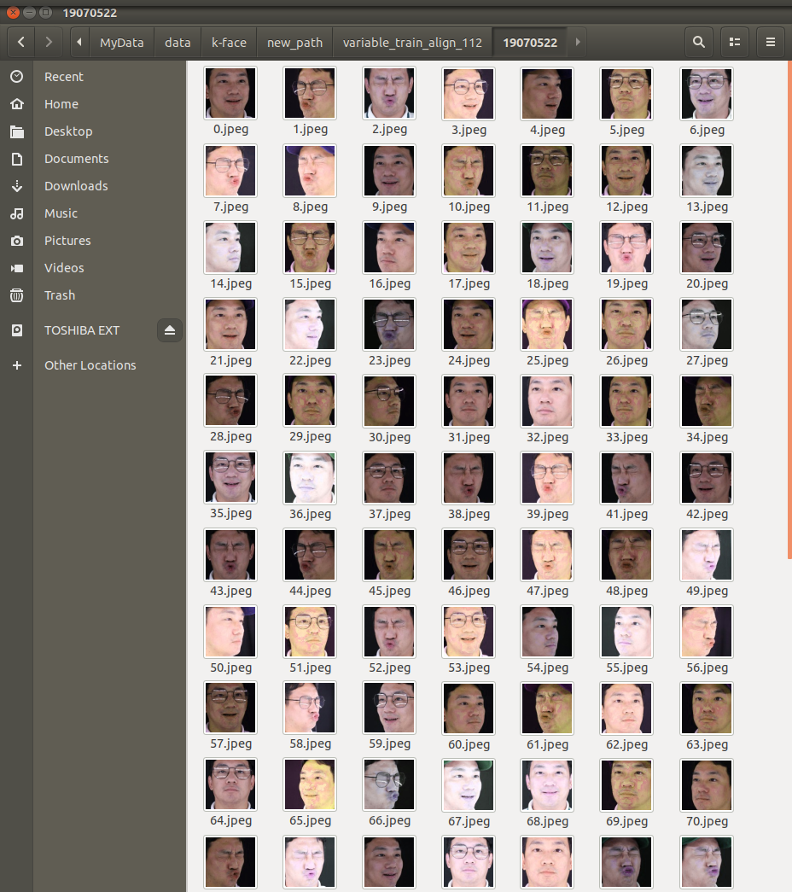

# Data Preprocessing

---

# dataset

* [Ms1m_align_112](https://drive.google.com/file/d/1X202mvYe5tiXFhOx82z4rPiPogXD435i/view)
* [AI_hub:K-Face](http://www.aihub.or.kr/aidata/73)

#   data preprocessing

## 1. MS1M_align_112 dataset
   - [download](https://drive.google.com/file/d/1X202mvYe5tiXFhOx82z4rPiPogXD435i/view)
   - [tfrecod set 만들기](https://github.com/shiney5213/Project-Arcface/blob/master/preprocessing/5.convert_train_binary_tfrecord.py)
## 2. K-face dataset
#### 1) [Select K-Face dataset](https://github.com/shiney5213/Project-Arcface/blob/master/preprocessing/1.Select%20_K-face_dataset_and_split_train_and_test.ipynb)
- 한 사람당 image가  32,400장으로 너무 많아 L1(조명-ㅣLux1000), S001(액세서리-보통), E01~E03(표정) 데이터만 사용하기로 함(1인당 train 40, test 20)
#### 2) [face_recognition](https://github.com/shiney5213/Project-Arcface/blob/master/preprocessing/2.face_recognition_align_112.ipynb)
- ms1m_align_112 데이터가 가로,세로 모두 112pixel로 얼굴만 detection한 이미지이므로 k-face 데이터셋도 얼굴만 detection하여 저장함
	
  
	
-  ms1m_align_112 dataset이 데이터 수도 많고, 정면 얼굴도 많아 k-face dataset과 확연히 비교가 됨.
	
#### 3) [More Select K-Face dataset](https://github.com/shiney5213/Project-Arcface/blob/master/preprocessing/3.Select_more_K-face_dataset.ipynb)
- k-face dataset에서 조명을 다양하게 하고, 수를 늘리는 재작업 수행
- 조명(L1, L2, L3),  액세서리(S001, S002, S005), 방향(C5~C10), 표정(E1, E2, E3) 데이터 사용(1인당 train 132, test 30)
- face detection 할 때 ms1m dataset과 비교하여 눈,코,입 부분만을 검출하거나 입이 잘리는 이미지가 있어 box크기를 조절함.
 
#### 4) [Variety Image](https://github.com/shiney5213/Project-Arcface/blob/master/preprocessing/4.make_variety_image.ipynb) : random으로 이미지에 톤의 변화를 줌.

- Gammma_LUD방법을 사용하여 hue, satuation값을 랜덤으로 조절

  <table>
      <tr>
      <td>
      <td>
      <td>
      <td>
      </tr>
  </table>

#### 5) [test data]() : K-face  test set 만들기 
- train data와 같이 얼굴을 찾아 112 * 112로 조절
- [file rename](https://github.com/shiney5213/Project-Arcface/blob/master/preprocessing/5_1.file_rename.ipynb) : 파일 이름을 폴더명(사람 이름)_0001.jpeg로 rename
- [k-face_pairs.txt 생성](https://github.com/shiney5213/Project-Arcface/blob/master/preprocessing/5_2.generate_pairs_txt.ipynb) : 같은 사람의 사진 pairs와 다른 사람의 사진 paris 를 표기한 txt 파일 생성
- [k-face.bin 생성 ](https://github.com/shiney5213/Project-Arcface/blob/master/preprocessing/5_3.make_kface_bin.py) : kface_prairs.txt 파일을 가지고 kface.bin 파일 생성

## 3. MS1M + KFcae 

- [trian data](https://github.com/shiney5213/Project-Arcface/blob/master/preprocessing/5.convert_train_binary_tfrecord.py) : ms1m dataset과 kface dataset을 함께 train dataset으로 사용

- tensorflow에서 빠르게  training 하기 위해 tfrecord 파일 만들기 
  
- slm_align_112 데이터:  85,742명, 5,822,653장
- K-face 데이터 :  400명,  49,491장  (52,800장을 기대했으나 face detection하면서 이미지가 줄어듦.) 
- **test시에는 더 성능이 좋은 face detection model을 사용해야겠음**
- 모두  86,142폴더, 5,872,144장 이미지 준비  

---

## reference
* [ArcFace](https://arxiv.org/abs/1801.07698): ArcFace Paper
* [InsightFace](https://github.com/deepinsight/insightface/) : 2D and 3D Face Analysis Project
* [arcface-tf2](https://github.com/peteryuX/arcface-tf2): InsightFace by tensorflow
* [preparing_data](https://github.com/Talgin/preparing_data) : preparing_data
* 
* 